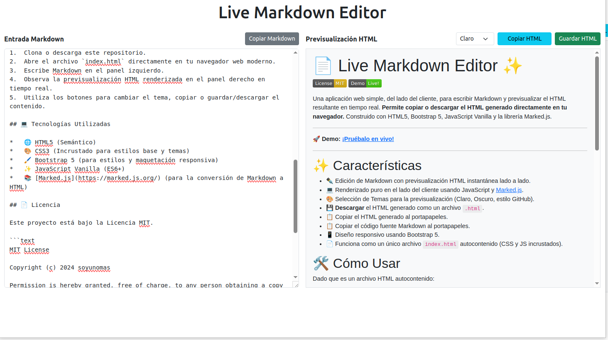

# 📄 Live Markdown Editor ✨

[](https://opensource.org/licenses/MIT) [](https://soyunomas.github.io/Live-Markdown-Editor/index.html)

Una aplicación web simple, del lado del cliente, para escribir Markdown y previsualizar el HTML resultante en tiempo real. **Permite copiar o descargar el HTML generado directamente en tu navegador.** Construido con HTML5, Bootstrap 5, JavaScript Vanilla y la librería Marked.js.

---

🚀 **Demo:** [**¡Pruébalo en vivo!**](https://soyunomas.github.io/Live-Markdown-Editor/index.html)

---



---
## ✨ Características

*   ✒️ Edición de Markdown con previsualización HTML instantánea lado a lado.
*   💻 Renderizado puro en el lado del cliente usando JavaScript y [Marked.js](https://marked.js.org/).
*   🎨 Selección de Temas para la previsualización (Claro, Oscuro, estilo GitHub).
*   💾 **Descargar** el HTML generado como un archivo `.html`.
*   📋 Copiar el HTML generado al portapapeles.
*   📋 Copiar el código fuente Markdown al portapapeles.
*   📱 Diseño responsivo usando Bootstrap 5.
*   📄 Funciona como un único archivo `index.html` autocontenido (CSS y JS incrustados).

## 🛠️ Cómo Usar

Dado que es un archivo HTML autocontenido:

1.  Clona o descarga este repositorio.
2.  Abre el archivo `index.html` directamente en tu navegador web moderno.
3.  Escribe Markdown en el panel izquierdo.
4.  Observa la previsualización HTML renderizada en el panel derecho en tiempo real.
5.  Utiliza los botones para cambiar el tema, copiar o guardar/descargar el contenido.

## 💻 Tecnologías Utilizadas

*   🌐 HTML5 (Semántico)
*   🎨 CSS3 (Incrustado para estilos base y temas)
*   🖌️ Bootstrap 5 (para estilos y maquetación responsiva)
*   ✨ JavaScript Vanilla (ES6+)
*   📚 [Marked.js](https://marked.js.org/) (para la conversión de Markdown a HTML)

## 📄 Licencia

Este proyecto está bajo la Licencia MIT.

```text
MIT License

Copyright (c) 2024 soyunomas

Permission is hereby granted, free of charge, to any person obtaining a copy
of this software and associated documentation files (the "Software"), to deal
in the Software without restriction, including without limitation the rights
to use, copy, modify, merge, publish, distribute, sublicense, and/or sell
copies of the Software, and to permit persons to whom the Software is
furnished to do so, subject to the following conditions:

The above copyright notice and this permission notice shall be included in all
copies or substantial portions of the Software.

THE SOFTWARE IS PROVIDED "AS IS", WITHOUT WARRANTY OF ANY KIND, EXPRESS OR
IMPLIED, INCLUDING BUT NOT LIMITED TO THE WARRANTIES OF MERCHANTABILITY,
FITNESS FOR A PARTICULAR PURPOSE AND NONINFRINGEMENT. IN NO EVENT SHALL THE
AUTHORS OR COPYRIGHT HOLDERS BE LIABLE FOR ANY CLAIM, DAMAGES OR OTHER
LIABILITY, WHETHER IN AN ACTION OF CONTRACT, TORT OR OTHERWISE, ARISING FROM,
OUT OF OR IN CONNECTION WITH THE SOFTWARE OR THE USE OR OTHER DEALINGS IN THE
SOFTWARE.
